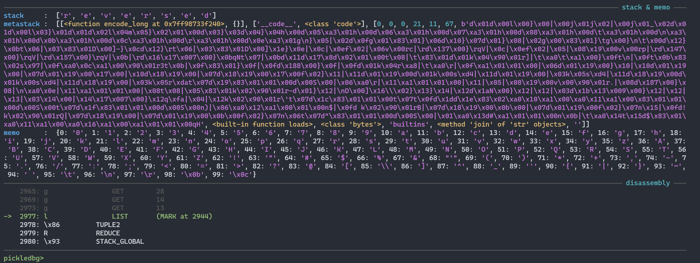

# pickledbg
`pickledbg` is a [GDB](https://www.sourceware.org/gdb/)+[GEF](https://github.com/hugsy/gef)-style debugger, where pickles are unpacked instruction by instruction, showing the Pickle Machine state (stack, metastack, and memo) at each step. Additional related tools are linked at the bottom of this README.

## Installation
```
$ pip install pickledbg -U
```

## Usage
```python
┌──(user㉿computer)-[~/pickledbg]
└─$ pickledbg
Usage: pickledbg.py <picklefile>

┌──(user㉿computer)-[~/pickledbg]
└─$ pickledbg examples/helloworld.pickle
pickledbg>  help
────────────────────────────────── pickledbg help ──────────────────────────────────
start
Starts the debugger, pointing to the first instruction but not executing it. Must
only be ran once. To restart debugging, close the program and run it again. Must
also be run before stepping through instructions.
Aliases: run

────────────────────────────────────────────────────────────────────────────────────
ni
Executes the next instruction and shows the updated Pickle Machine state. Must be
ran after 'start'.
Aliases: next

────────────────────────────────────────────────────────────────────────────────────
step
Executes the next given number of instructions and shows the updated Pickle Machine 
state.
Syntax: step <number>

────────────────────────────────────────────────────────────────────────────────────
step-to
Executes instructions until the instruction address is reached and shows the updated
Pickle Machine state.
Syntax: step-to <address>

────────────────────────────────────────────────────────────────────────────────────
export
Writes the disassembly of the pickle to a file. If no filename is specified, the
default is 'out.disasm'.
Syntax: export [filename]

────────────────────────────────────────────────────────────────────────────────────
show options
Shows the current options and their values.

────────────────────────────────────────────────────────────────────────────────────
set
Sets an option to a value.
Syntax: set <option> <value>

────────────────────────────────────────────────────────────────────────────────────
help
Shows this help menu. Type 'help options' for available options.
Aliases: ?

────────────────────────────────────────────────────────────────────────────────────
exit
Exits the debugger.
Aliases: quit

────────────────────────────────────────────────────────────────────────────────────
pickledbg>
```

(*Example of what the debug interface looks like when running.*)



## Changelog
You can find the changelog [here](./Changelog.md).

## Contributing
If you are interesting in contributing to `pickledbg`, feel free to create an issue or make a pull request.

## Related Resources
* https://docs.python.org/3/library/pickletools.html
    * Official tool for developers to inspect and disassemble pickles
* https://github.com/Legoclones/pickledoc
    * Unofficial pickle documentation
* https://github.com/trailofbits/fickling
    * Pickle decompiler and static analyzer
* https://github.com/splitline/Pickora
    * Python module to turn Python scripts into pickles
* https://github.com/gousaiyang/pickleassem
    * Pickle assembler
